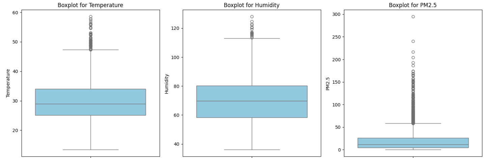
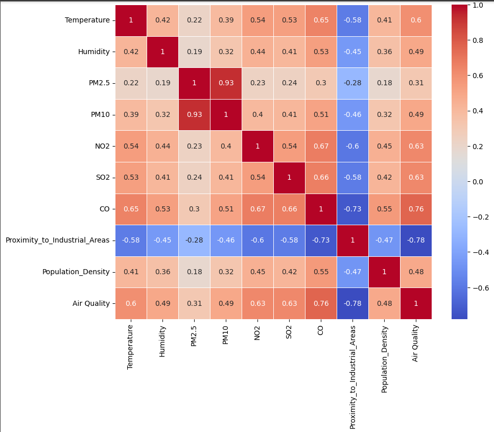

## Laporan Proyek Mechine Learning - Wahid Hasim Santoso

## Domain Proyek

Polusi udara menjadi salah satu penyebab utama kematian di dunia. Data dari WHO menunjukkan bahwa
polusi udara bertanggung jawab atas jutaan kematian setiap tahunnya, serta berbagai penyakit
pernapasan dan jantung yang mengancam nyawa. Dalam beberapa tahun terakhir, kualitas udara semakin
memburuk, terutama di kawasan perkotaan yang padat.

Peningkatan polusi udara menjadi masalah besar di banyak daerah perkotaan. Aktivitas manusia seperti
transportasi, industri, dan pembangunan kota semakin memperburuk kualitas udara, dengan tingkat
polusi yang sering melebihi ambang batas yang ditetapkan oleh organisasi kesehatan dunia. Namun,
banyak daerah yang masih mengalami kesulitan dalam memantau polusi udara secara akurat dan
real-time.

Selain itu, minimnya kesadaran masyarakat mengenai dampak polusi udara terhadap kesehatan menjadi
tantangan besar. Banyak yang tidak menyadari betapa seriusnya risiko yang ditimbulkan, dan
langkah-langkah preventif sering kali diabaikan. Di sisi lain, tanpa adanya data yang cukup,
perencanaan kebijakan untuk mengatasi polusi udara juga menjadi sangat sulit dilakukan oleh
pemerintah dan organisasi lingkungan.

Dalam konteks ini, proyek ini sangat relevan untuk pemerintah, organisasi lingkungan, dan masyarakat
umum, karena kualitas udara yang buruk memiliki dampak signifikan pada kesehatan manusia dan
ekosistem.

Relevansi proyek ini adalah sebagai berikut:

1. Pemantauan Kualitas Udara yang Akurat: Proyek ini membantu memberikan prediksi kualitas udara
   secara real-time berdasarkan data lingkungan. Dengan memanfaatkan algoritma prediktif, proyek ini
   mampu mengidentifikasi pola polusi udara dan memberikan wawasan tentang risiko kesehatan terkait.

2. Pengambilan Keputusan Berbasis Data: Model prediktif dalam proyek ini memungkinkan pemerintah dan
   organisasi lingkungan untuk mengambil keputusan yang lebih baik dalam mengelola sumber daya,
   mengurangi emisi, dan meningkatkan kualitas udara secara keseluruhan.

Manfaat bagi Pemerintah dan Organisasi Lingkungan:

- Perencanaan Kebijakan: Data prediksi dapat digunakan untuk menyusun kebijakan berbasis data yang
  efektif dalam mengurangi polusi udara dan melindungi kesehatan masyarakat.
- Peringatan Dini: Prediksi kualitas udara dapat membantu mengeluarkan peringatan dini kepada
  masyarakat terkait tingkat polusi yang berbahaya.
- Monitoring Efektivitas Kebijakan: Melalui analisis data historis dan prediksi, efektivitas
  kebijakan pengurangan polusi dapat dievaluasi.

Manfaat bagi Masyarakat:

- Kesadaran Lingkungan: Informasi tentang kualitas udara memungkinkan masyarakat untuk mengambil
  langkah-langkah pencegahan, seperti menghindari aktivitas di luar ruangan pada waktu tertentu.
- Kesehatan yang Lebih Baik: Dengan mengetahui kondisi udara, masyarakat dapat melindungi diri dari
  risiko kesehatan yang disebabkan oleh polusi udara.

## Business Understanding

### Problem Statements

1. Bagaimana cara mengembangkan model prediktif untuk memprediksi kualitas udara menggunakan
   algoritma machine learning?
2. Apa teknik pre-pemrosesan data yang paling efektif untuk memastikan data kualitas udara dapat
   digunakan dalam model prediktif?

3. Bagaimana cara memilih parameter fitur yang relevan dan memiliki pengaruh signifikan terhadap
   kualitas udara dalam sebuah model prediktif?

### Goals

1. Mengembangkan model prediktif kualitas udara dengan algoritma Machine Learning.
2. Melakukan pre-pemrosesan data dengan baik agar dapat digunakan.
3. Menentukan parameter feature yang memilki dampak besar kepada parameter target (kualitas udara).

### Solution statements

Solusi yang diberikan untuk proyek ini melibatkan beberapa tahapan dan algoritma yang digunakan.
Berikut adalah penjelasan yang lebih rinci mengenai solusi yang diberikan:

1.  Eksplorasi Data (Exploratory Data Analysis - EDA) Sebelum melatih model, tahapan Exploratory
    Data Analysis (EDA) akan dilakukan untuk memahami karakteristik data yang tersedia. EDA membantu
    untuk:

    - Mengidentifikasi pola yang ada dalam data,
    - Menilai distribusi data untuk masing-masing fitur (misalnya usia, riwayat medis, jenis
      kelamin),
    - Memahami hubungan antar variabel (misalnya apakah ada korelasi antara BMI dan biaya
      pengobatan),
    - Mengidentifikasi adanya missing values dan outliers yang perlu ditangani.
    - Langkah EDA ini penting untuk memberikan gambaran awal tentang data dan mempersiapkan data
      untuk pemodelan lebih lanjut.

2.  Pemilihan Algoritma dan Model Beberapa algoritma akan digunakan untuk membangun model prediktif
    yang dapat memprediksi premi asuransi kesehatan secara lebih akurat. Algoritma yang dipilih
    meliputi:

    - Random Forest Classifier: Random Forest adalah algoritma pembelajaran ensemble yang bekerja
      dengan membangun banyak pohon keputusan dan menggabungkan hasilnya untuk meningkatkan akurasi
      prediksi. Algoritma ini efektif untuk menangani data dengan banyak fitur dan mampu menangani
      ketidakseimbangan kelas.

    - K-Nearest Neighbors (KNN): KNN adalah algoritma pembelajaran berbasis instance yang
      memprediksi kelas atau nilai dari titik data berdasarkan kedekatannya dengan titik data
      lainnya dalam dataset. Algoritma ini sederhana namun efektif untuk dataset dengan distribusi
      yang jelas.

3.  Evaluasi Model Untuk mengevaluasi kinerja model, beberapa metrik evaluasi digunakan:

    Akurasi, Precision, Recall, dan F1-Score (untuk model klasifikasi): Jika model dipakai untuk
    klasifikasi, seperti untuk mengklasifikasikan kelompok risiko tinggi atau rendah, metrik ini
    akan digunakan untuk mengukur kinerja model dalam hal:

    - Akurasi: Seberapa sering prediksi model benar. Precision: Berapa banyak prediksi positif yang
      benar.
    - Recall: Seberapa banyak data positif yang dapat diprediksi dengan benar. F1-Score: Harmonik
    - rata-rata precision dan recall, digunakan ketika ada ketidakseimbangan antara kelas. Melalui
    - evaluasi dengan metrik ini, kita dapat menilai seberapa efektif dan akurat model dalam
      memprediksi tingkat qualitas udara pada lingkungan dengan tepat.

## Data Understanding

Dataset dapat diunduh di:
[Air Quality and Pollution Assessment](https://www.kaggle.com/datasets/mujtabamatin/air-quality-and-pollution-assessment).

### Sample data

| Metric    | Temperature | Humidity | PM2.5   | PM10    | NO2     | SO2     | CO      | Proximity_to_Industrial_Areas | Population_Density | Air Quality |
| --------- | ----------- | -------- | ------- | ------- | ------- | ------- | ------- | ----------------------------- | ------------------ | ----------- |
| **Count** | 5000.00     | 5000.00  | 5000.00 | 5000.00 | 5000.00 | 5000.00 | 5000.00 | 5000.00                       | 5000.00            | 5000.00     |
| **Mean**  | 30.03       | 70.06    | 20.14   | 30.22   | 26.41   | 10.01   | 1.50    | 8.43                          | 497.42             | 1.30        |
| **Std**   | 6.72        | 15.86    | 24.55   | 27.35   | 8.90    | 6.75    | 0.55    | 3.61                          | 152.75             | 1.19        |
| **Min**   | 13.40       | 36.00    | 0.00    | -0.20   | 7.40    | -6.20   | 0.65    | 2.50                          | 188.00             | 0.00        |
| **25%**   | 25.10       | 58.30    | 4.60    | 12.30   | 20.10   | 5.10    | 1.03    | 5.40                          | 381.00             | 0.00        |
| **50%**   | 29.00       | 69.80    | 12.00   | 21.70   | 25.30   | 8.00    | 1.41    | 7.90                          | 494.00             | 1.50        |
| **75%**   | 34.00       | 80.30    | 26.10   | 38.10   | 31.90   | 13.73   | 1.84    | 11.10                         | 600.00             | 2.00        |
| **Max**   | 58.60       | 128.10   | 295.00  | 315.80  | 64.90   | 44.90   | 3.72    | 25.80                         | 957.00             | 3.00        |

Berikut informasi pada dataset :

- Dataset memiliki format CSV (Comma-Seperated Values).
- Dataset memiliki 9 fitur bertipe int64 dan float64.
- Tidak ada missing value dalam dataset.
- Tidak ada data duplicated dalam dataset.

### Variabel-variabel pada Medical Insurance Premium Prediction dataset adalah sebagai berikut:

| Feature                           | Description                                                       |
| --------------------------------- | ----------------------------------------------------------------- |
| **Temperature**                   | Measured temperature (°C) in the region.                          |
| **Humidity**                      | Humidity level (%) in the region.                                 |
| **PM2.5**                         | Concentration of fine particulate matter (µg/m³).                 |
| **PM10**                          | Concentration of particulate matter with diameter ≤10 µm (µg/m³). |
| **NO2**                           | Nitrogen Dioxide concentration (ppb).                             |
| **SO2**                           | Sulfur Dioxide concentration (ppb).                               |
| **CO**                            | Carbon Monoxide concentration (ppm).                              |
| **Proximity_to_Industrial_Areas** | Distance to industrial areas (km).                                |
| **Population_Density**            | Population density (per square km).                               |
| **Air Quality**                   | Encoded Air Quality categories (Good, Moderate, Poor, etc.).      |

---

### Pendalaman Data Understanding

- Melakukan tahapan EDA seperti mendeskripsikan variabel, mencari *outlier*s, Univariate hingga
  Multi-variate analysis.
- Untuk menganalisa *outlier*s bisa menggunaka boxplot dengan memanggil fungsi .plot() pada pandas
- Mengecek data missing value data missing value.
- Mencari keterkaitan antar fitur dan target dengan correlation matrix menggunakan visualisasi
  heatmap.

### Visualisasi proses Data Understanding

Untuk mengatasi outlier, salah satu metode yang umum digunakan adalah metode IQR (Interquartile
Range) dengan visualisasi menggunakan boxplot. Berikut penjelasan mengenai metode IQR dan
visualisasi boxplot:

Metode IQR:

1. Konsep: IQR merupakan ukuran statistik yang menggambarkan rentang atau sebaran data pada bagian
   tengah distribusi data. IQR dihitung dengan mengurangi nilai kuartil ketiga (Q3) dengan nilai
   kuartil pertama (Q1). Outlier dianggap sebagai nilai yang terletak di luar rentang IQR yang
   ditentukan.
2. Cara Kerja:
   - Hitung Q1 (kuartil pertama) dan Q3 (kuartil ketiga) dari data.
   - Hitung IQR dengan mengurangi Q1 dari Q3.
   - Tentukan batas atas dan batas bawah untuk outlier dengan menggunakan rumus: batas atas = Q3 +
     (1.5 _ IQR), batas bawah = Q1 - (1.5 _ IQR).
   - Data yang berada di luar batas atas dan batas bawah tersebut dianggap sebagai outlier.

Visualisasi Boxplot:

1. Konsep: Boxplot adalah visualisasi grafis yang digunakan untuk menganalisis distribusi data dan
   mengidentifikasi adanya outlier. Boxplot menampilkan beberapa ukuran statistik, termasuk Q1, Q3,
   median, serta batas atas dan batas bawah untuk outlier.
2. Cara Kerja:
   - Boxplot terdiri dari sebuah kotak (box) yang menunjukkan rentang IQR (dari Q1 hingga Q3).
   - Garis di dalam kotak menunjukkan posisi median.
   - Whisker atau garis lurus yang terhubung dengan kotak menunjukkan rentang data yang dianggap
     tidak sebagai outlier.
   - Titik-titik di luar whisker menunjukkan adanya outlier.



###### Gambar 6.1 Visualisasi outliers menggunakan boxplot

Dengan menggunakan metode IQR dan visualisasi boxplot, kita dapat mengidentifikasi dan mengatasi
outlier dalam data. Outlier dapat menjadi nilai yang ekstrem dan tidak biasa yang dapat mempengaruhi
hasil analisis statistik dan model prediksi.

Dengan memperhatikan IQR dan melihat visualisasi boxplot, kita dapat menentukan batas atas dan batas
bawah untuk outlier, serta mengambil tindakan yang tepat, seperti menghapus atau mengelola outlier
tersebut, agar tidak mempengaruhi hasil analisis secara signifikan.

Kemudian, untuk menganalisa keterkaitan antara fitur numerik dan fitur target, kita dapat
menggunakan heatmap.

Heatmap menunjukkan tingkat korelasi antara setiap pasangan fitur numerik dan fitur target. Warna
dalam heatmap mencerminkan tingkat korelasi, di mana warna lebih terang menunjukkan korelasi yang
lebih kuat, sedangkan warna lebih gelap menunjukkan korelasi yang lebih lemah atau tidak ada
korelasi.

Kita dapat melihat hubungan positif atau negatif antara fitur numerik dan fitur target berdasarkan
nilai korelasi. Analisis ini membantu dalam memahami keterkaitan antar fitur-fitur dalam dataset dan
dapat memberikan wawasan yang berguna untuk pemilihan fitur, pemodelan, atau analisis lebih lanjut.

Dengan menggunakan correlation matrix dan visualisasi heatmap, kita dapat dengan mudah menganalisa
keterkaitan antara fitur numerik dan fitur target dalam dataset secara visual dan kuantitatif.



###### Gambar 6.3 Matriks korelasi PremiumPrice

Dapat dilihat dari gambar matriks di atas bahwa variabel _Proximity to Industrial Areas_ , dan
_PM2.5_ merupakan variable yang tidak memilki korelasi dan memilki korelasi terendah dengan fitur
target _air quality_

## Data Preparation

Berikut ada teknik yang digunakan dalam proses data preparation, yaitu:

1. Transformasi Data

- Dengan menggunakan LabelEncoder dari library skleran.
- Tujuannya adalah untuk mengubah data kategori menjadi numerik:
  - ['Good' 'Hazardous' 'Moderate' 'Poor'] menjadi [2 0 1 3]
- Transformasi data sangat direkomendasikan karena untuk

2. Membersihkan outliers

- Membuang semua outlier yang ada dengan membuang data yang memiliki outlier.
- Tujuannya adalah untuk mengurangi bias yang ada pada data.

3. Mengurangi feature yang tidak memiliki pengaruh besar kepada target

- Membuang kolom "Proximity_to_Industrial_Areas" dan "PM2.5"
- Tujuanya adalah untuk membuat analisis lebih efisien, karena kedua feature tersebut merupakan
  feature yang memilki korelasi paling rendah dengan target

4. Pembagian Dataset:

- Data Train dan Data Test Dataset dibagi menjadi dua bagian utama: data training dan data testing
  menggunakan library sklearn.
- Rasio pembagian yang digunakan adalah 80:20, di mana:
  - 80% data digunakan untuk melatih model (training).
  - 20% data digunakan untuk menguji performa model (testing). Proses ini bertujuan untuk
    menghindari overfitting dan memastikan model dapat generalize dengan baik pada data baru yang
    belum pernah dilihat sebelumnya.

5. Standarisasi Data Numerik Standarisasi

- dilakukan dengan menggunakan StandardScaler dari library sklearn.
- Tujuan dari standarisasi adalah untuk mengurangi bias pada fitur numerik dengan menyelaraskan data
  ke skala yang seragam:
  - Rata-rata (mean): 0.
  - Simpangan baku (standard deviation): 1.
- Standarisasi sangat penting terutama jika dataset memiliki fitur numerik dengan rentang nilai yang
  berbeda-beda, yang dapat memengaruhi performa model.

Pentingnya melakukan data preparation:

1. Mempermudah proses alaytc dengan mengubah variabel kategori menjadi numerik.
2. Mengurangi Bias: Terdapat beberapa algoritma Machine Learning yang sangat sensitif terhadap
   outliers, hal tersbut akan membuat
3. Mengurangi Bias: Standarisasi membantu memastikan fitur numerik tidak mendominasi perhitungan
   model. Meningkatkan Akurasi:
4. Pembagian dataset memastikan performa model diuji pada data baru sehingga hasil evaluasi lebih
   relevan.

## Model Development

Dalam proses modeling, proyek ini akan menggunakan algoritma _RandomForestClassifier_ dan _KNN_

Dalam proyek ini, algoritma RandomForestClassifier dan K-Nearest Neighbors (KNN) digunakan untuk
memprediksi klasifikasi qualitas udara. Berikut adalah penjelasan konsep dan cara kerja
masing-masing algoritma:

1. _RandomForestClassifier_

- Konsep: Random Forest adalah metode pembelajaran ansambel yang menggabungkan beberapa pohon
  keputusan (decision trees) untuk membuat prediksi yang lebih akurat dan stabil. Algoritma ini
  bekerja dengan membangun banyak pohon keputusan pada subset data training dan kemudian
  menggabungkan hasilnya (melalui voting untuk klasifikasi) untuk meningkatkan akurasi.
- Cara Kerja: Dataset diacak secara acak untuk membangun setiap pohon keputusan (bootstrap
  sampling). Setiap pohon hanya menggunakan subset dari fitur yang tersedia, sehingga meningkatkan
  kemampuan model untuk menghindari overfitting. Prediksi akhir ditentukan berdasarkan mayoritas
  (majority voting) dari pohon-pohon yang ada.
- Dengan paramter n_estimators(jumlah pohon) sebanyak 100 dan default random_state yaitu 42

2. _K-Nearest Neighbors (KNN)_

- Konsep: KNN adalah algoritma sederhana berbasis kedekatan (distance-based algorithm) yang
  memprediksi nilai atau kelas target berdasarkan kedekatan dengan data poin lainnya. Tidak
  memerlukan pelatihan eksplisit, karena prediksi dilakukan berdasarkan data training secara
  langsung.
- Cara Kerja: Algoritma menghitung jarak antara data baru dan semua data dalam dataset (biasanya
  menggunakan Euclidean distance). Data baru diklasifikasikan berdasarkan mayoritas kelas dari k
  tetangga terdekat (k nearest neighbors). Nilai k adalah parameter penting yang menentukan jumlah
  tetangga yang digunakan dalam prediksi.
- Dengan parameter n_neighbors sebanyak 5

Dengan menggunakan konsep dan cara kerja yang telah dijelaskan, algoritma _RandomForestClassifier_
dan _KNN_ dapat menghasilkan prediksi kualitas udara yang cukup akurat dan tahan terhadap pencilan
(outliers) dalam data.

### Tahapan yang dilakukan

Berikut adalah urutan tahapan yang dilakukan dalam proses modeling:

- Melatih model dengan data training dengan menggunakan algoritma _RandomForestClassifier_ dengan
  parameter (n_estimators=100, random_state=42 ) maksudnya adalah membuat model Random Forest dengan
  100 pohon keputusan dan mengatur random_state untuk hasil yang dapat direproduksi.
- Melatih model dengan data training menggunakan algoritma K-Nearest Neighbors (KNN) dengan
  parameter (n_neighbors=5) berarti algoritma akan menggunakan 5 tetangga terdekat untuk menentukan
  kelas atau nilai prediksi suatu data.
- Melakukan pengujian dengan data testing
- Melihat hasil performa model antara hasil data training dan data testing

- _RandomForestClassifier_\_ _accuracy_: memiliki akurasi mencapai 0.95 dengan hasil ini menunjukkan
  bahwa model memiliki tingkat akurasi yang cukup tinggi karena mendekati 1.
- _KNN_\_ _accuracy_: memiliki akurasi mencapai 0.93 dengan hasil ini menunjukkan bahwa model
  memiliki tingkat akurasi yang cukup tinggi karena mendekati 1.

Kesimpulan yang dapat diambil dari paparan di atas ialah secara keseluruhan, hasil ini menunjukkan
bahwa semua model mampu mempelajari pola pada data secara maksimal sehingga memiliki tingkat akurasi
yang cukup tinggi pada semua model yang dipakai.

## Evaluation

Metrik yang Digunakan Dalam project ini:

Proyek ini menggunakan beberapa metrik evaluasi untuk mengukur kinerja model dalam memprediksi
kualitas udara. Berikut adalah penjelasan masing-masing metrik serta evaluasi terhadap dua model
yang diuji: Random Forest Classifier dan KNN.

### Metrik Evaluasi yang Digunakan

1. Accuracy Mengukur proporsi prediksi yang benar terhadap keseluruhan data.

- Kelebihan: Sederhana dan intuitif.
- Kekurangan: Tidak cukup informatif untuk dataset dengan distribusi kelas yang tidak seimbang.

2. Precision Mengukur ketepatan prediksi positif terhadap semua prediksi positif.

- Fokus: Seberapa akurat model dalam memprediksi kelas tertentu.
- Penting: Berguna saat kesalahan positif memiliki dampak besar.

3. Recall Mengukur kemampuan model untuk menangkap semua contoh aktual positif.

- Fokus: Kemampuan model mendeteksi semua data positif.
- Penting: Berguna untuk mengurangi risiko mengabaikan prediksi positif penting.

4. F1-Score Rata-rata harmonis dari precision dan recall.

- Fokus: Memberikan keseimbangan antara precision dan recall.
- Penting: Berguna dalam kasus di mana precision dan recall tidak seimbang.

5. Support Jumlah sampel aktual di setiap kelas.

### Berdasarkan hasil evaluasi:

1. Random Forest Classifier

- Accuracy: 0.95
- Classification Report:

```bash
               precision    recall  f1-score   support
           0       0.99      1.00      0.99       419
           1       0.84      0.55      0.67        38
           2       0.95      0.96      0.96       275
           3       0.84      0.90      0.87       150

    accuracy                           0.95       882
   macro avg       0.91      0.85      0.87       882
weighted avg       0.95      0.95      0.95       882
```

2. K-Nearest Neighbors (KNN)

- Accuracy: 0.93
- Classification Report:

```bash
               precision    recall  f1-score   support
           0       0.97      1.00      0.98       419
           1       0.77      0.53      0.62        38
           2       0.92      0.93      0.93       275
           3       0.84      0.81      0.83       150

    accuracy                           0.93       882
   macro avg       0.88      0.82      0.84       882
weighted avg       0.92      0.93      0.92       882
```

### Analisis Hasil Evaluasi

1. Random Forest Classifier

- Memiliki performa terbaik dengan akurasi 0.95 dan keseimbangan precision, recall, serta F1-score
  yang baik di semua kelas.
- Sangat cocok untuk digunakan pada skenario dengan distribusi kelas yang bervariasi.

2. KNN

- Performa baik dengan akurasi 0.93, namun kurang efektif dalam menangani kelas minoritas seperti
  kelas 1.
- Lebih cocok untuk dataset yang tidak terlalu kompleks.

### Relevansi dengan Business Understanding

1. Apakah model menjawab problem statement? Ya, model prediktif yang dihasilkan berhasil memprediksi
   kualitas udara dengan akurasi tinggi. Random Forest memiliki performa terbaik untuk mendukung
   kebutuhan organisasi berbasis data.

2. Apakah solusi mencapai goals yang diharapkan? Ya, hasil prediksi memberikan wawasan mengenai
   faktor apa saja yang memilki keterkaitan tinggi terhadap kualitas udara dengan melihat feature
   yang dipakai, sehingga membantu organisasi membuat kebijakan berbasis data dan memberikan
   peringatan dini kepada masyarakat.

3. Apakah solusi memberikan dampak?

- Bagi Pemerintah dan Organisasi Lingkungan: Meningkatkan efisiensi dalam pengelolaan sumber daya
  dan pengambilan keputusan berbasis data.
- Bagi Masyarakat: Memberikan informasi kualitas udara secara real-time, meningkatkan kesadaran, dan
  mendorong langkah-langkah pencegahan.

### Kesimpulan

Random Forest Classifier dipilih sebagai model terbaik untuk proyek ini karena memiliki akurasi
tinggi dan kinerja yang seimbang di semua metrik evaluasi. Model ini secara efektif mendukung tujuan
bisnis dan memberikan solusi yang relevan terhadap problem statement.
